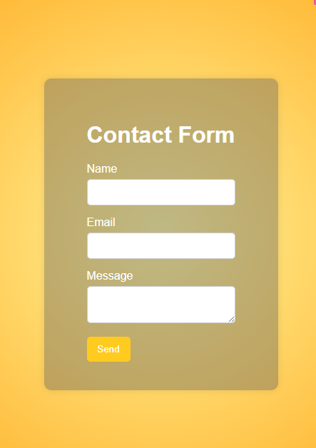
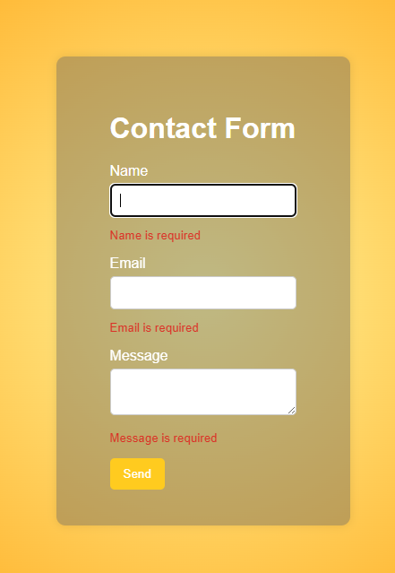
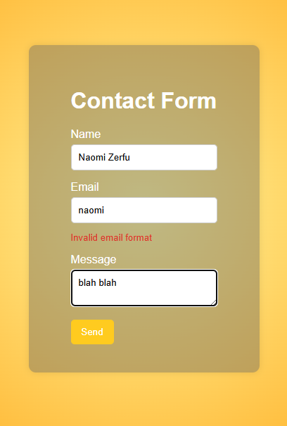

# Simple Contact Form

This is a simple and responsive contact form built using React and React Hook Form.  
It includes validation for required fields and email format.

## Screenshots

### General View



### Required Field Error

When the form is submitted without filling in the required fields:  


### Invalid Email Format

When the email format is incorrect:  


## Features

- Responsive form layout
- Validation for required fields
- Email format validation
- Real-time error messages

## How to run

1. Clone the repository

2. Run these commands

```bash
cd your-project-folder
npm i
npm run dev
```
